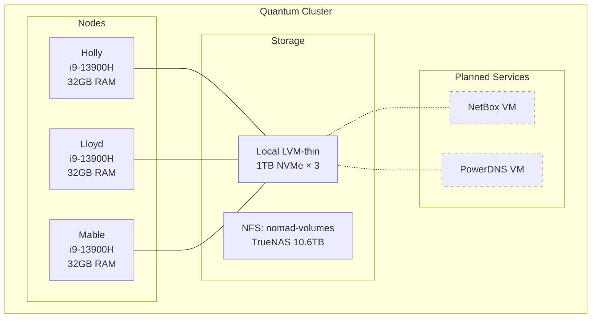
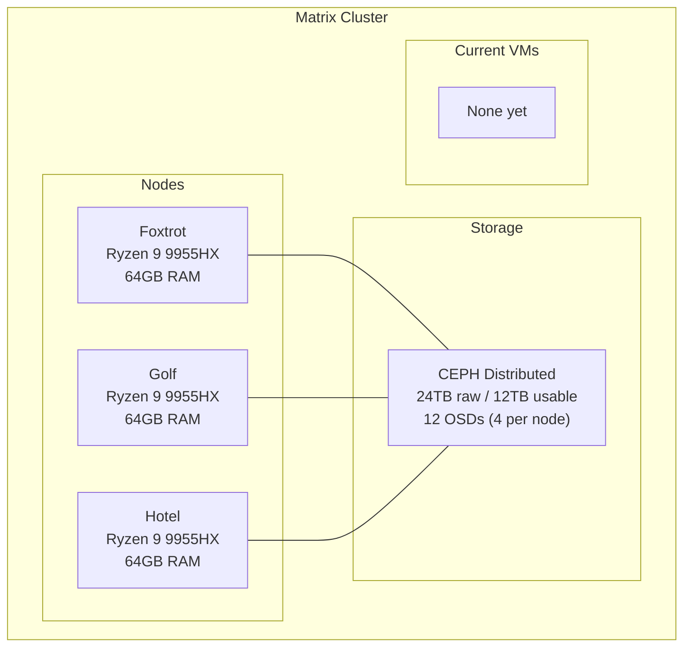

# Infrastructure Overview

This document shows where infrastructure components live, how they connect, and what runs on each cluster.

## Quick Reference

| Cluster | Role | Nodes | Current State | Planned Additions |
|---------|------|-------|---------------|-------------------|
| **Quantum** | Infrastructure | Holly, Lloyd, Mable | Empty (idle) | NetBox, PowerDNS |
| **Matrix** | Workload | Foxtrot, Golf, Hotel | Empty (ready) | Production VMs |
| **Nexus** | Legacy/Mixed | Alpha, Bravo | Active (VMs/LXCs) | Migrate or sunset |

### Shared Infrastructure

| Service | Location | IP | Clusters Served |
|---------|----------|-----|-----------------|
| TrueNAS | Standalone | 192.168.30.6 | Nexus, Quantum |
| PBS | Standalone | 192.168.30.200 | All (currently offline) |
| UDMP-Max | Gateway | 192.168.1.1 | All |

## Physical Topology

Network layer showing switches and cluster connections:

```mermaid
graph TB
    subgraph "Network Layer"
        UDMP["UDMP-Max<br/>Gateway<br/>192.168.1.1"]
        PRO["USW-Pro-Max-24-PoE<br/>Central Switch<br/>192.168.1.51"]
        AGG["USW Aggregation<br/>Matrix CEPH<br/>192.168.1.49"]
        FLEX["USW Flex XG<br/>Quantum CEPH<br/>192.168.1.212"]
    end

    UDMP --- PRO
    PRO --- AGG
    PRO --- FLEX

    subgraph "Infrastructure Cluster"
        Q_MGMT["Quantum<br/>Holly, Lloyd, Mable<br/>Mgmt: 2.5G"]
        Q_CEPH["CEPH Public<br/>10G × 3"]
    end

    subgraph "Workload Cluster"
        M_MGMT["Matrix<br/>Foxtrot, Golf, Hotel<br/>Mgmt: 1G"]
        M_CEPH["CEPH Pub+Priv<br/>10G × 6"]
    end

    subgraph "Legacy Cluster"
        N_NODES["Nexus<br/>Alpha, Bravo<br/>1-2.5G"]
    end

    subgraph "Storage"
        NAS["TrueNAS<br/>10G SFP+"]
    end

    PRO --> Q_MGMT
    FLEX --> Q_CEPH
    PRO --> M_MGMT
    AGG --> M_CEPH
    PRO --> N_NODES
    PRO --> NAS

    style Q_MGMT fill:#1e3a5f
    style Q_CEPH fill:#1e3a5f
    style M_MGMT fill:#1a4d1a
    style M_CEPH fill:#1a4d1a
    style N_NODES fill:#4a4a4a
```

### Switch Port Summary

| Switch | Ports Used | Clusters |
|--------|------------|----------|
| USW-Pro-Max-24-PoE | 10-12, 19-20, 22-25 | All (management) |
| USW Aggregation | SFP+ 1-6 | Matrix (CEPH) |
| USW Flex XG | Ports 2-4 | Quantum (CEPH) |

For port-level detail, see [switch-topology.md](switch-topology.md).

## Quantum - Infrastructure Cluster

Runs management services that other clusters depend on.

**Network:**

- VLAN 10 (Quantum-MGMT): 192.168.10.0/24
- VLAN 11 (Quantum-CEPH-Public): 192.168.11.0/24

**Why infrastructure runs here:**

- Uses local storage, not CEPH it would manage
- Survives Matrix cluster outages
- No circular dependencies

## Matrix - Workload Cluster

Runs production VMs on distributed CEPH storage.

**Network:**

- VLAN 30 (Matrix-MGMT): 192.168.3.0/24
- VLAN 7 (Matrix-CEPH-Public): 192.168.5.0/24
- VLAN 8 (Matrix-CEPH-Private): 192.168.7.0/24
- VLAN 9 (Corosync): 192.168.8.0/24

**Why workloads run here:**

- High-performance CEPH storage with NVMe OSDs
- 10GbE dedicated CEPH networks with jumbo frames
- Management services run elsewhere (no overhead)

## Nexus - Legacy Cluster

Original cluster with mixed workloads. Planned for migration or sunset.

| Node | Hardware | Storage | Current Use |
|------|----------|---------|-------------|
| Alpha (Protectli) | i3-10110U, 64GB | 3.6TB SATA + 1.8TB NVMe | Docker hosts, LXCs |
| Bravo (Dell T430) | 2× Xeon E5-2680 v4, 256GB | 10.9TB local | VMs, containers |

**Network:**

- VLAN 3 (Homelab-Servers): 192.168.30.0/24

## Legend

| Style | Meaning |
|-------|---------|
| Solid box/line | Exists now |
| Dashed box/line | Planned |
| Blue background | Infrastructure cluster (Quantum) |
| Green background | Workload cluster (Matrix) |
| Gray background | Legacy/mixed (Nexus) |

## Design Principles

1. **No circular dependencies** - Infrastructure services (NetBox, PowerDNS) run on Quantum with local/NFS storage, not on the CEPH they manage.

2. **Management plane separation** - Quantum can survive Matrix being down. DNS and IPAM remain available during workload cluster maintenance.

3. **Workload isolation** - Matrix runs production VMs without management service overhead. Clean separation of concerns.

## Related Documentation

- [ARCHITECTURE.md](../ARCHITECTURE.md) - Detailed hardware and network specs
- [Switch Topology](switch-topology.md) - Port-level connections
- [IPAM/DNS Design](../plans/2025-11-25-ipam-dns-stack-design.md) - NetBox + PowerDNS architecture
- [ADR-0001](../decisions/0001-powerdns-over-unifi-dns.md) - PowerDNS decision rationale
